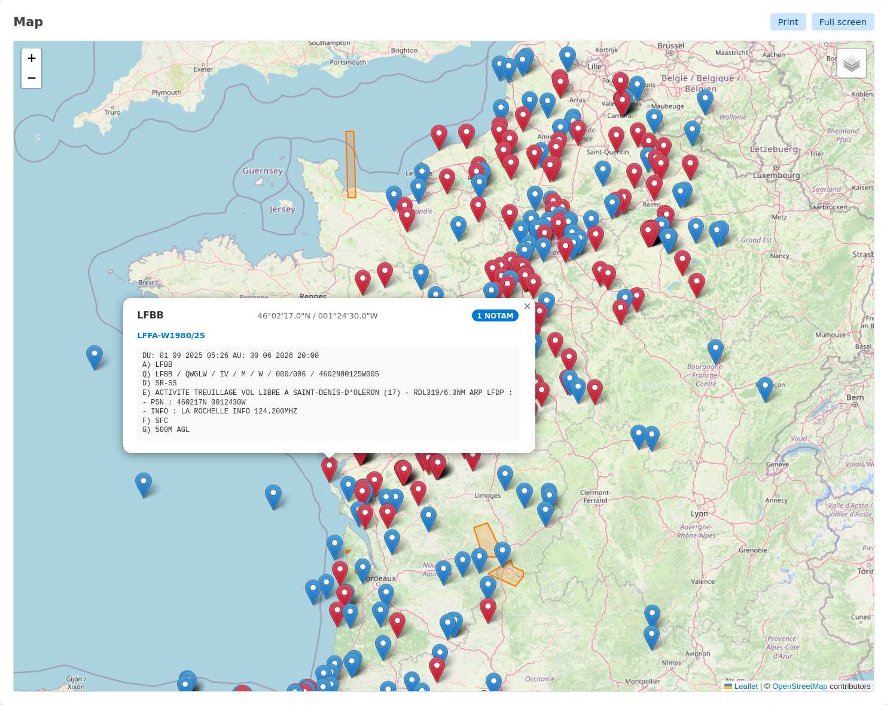

# NOTAM Viewer

A web-based tool to parse NOTAMs (Notice to Airmen) and display their geographic coordinates on an interactive map.



## Features

- Parse NOTAMs and extract coordinates from PSN (position), areas, and qualifier line
- Display NOTAM positions as markers and areas as polygons on an interactive map
- Multiple layers available: OpenStreetMap, OpenTopoMap, IGN Ortho, Google Satellite and Bing Aerial
- Direct copy/paste from [SOFIA-Briefing](https://sofia-briefing.aviation-civile.gouv.fr/) and [autorouter](https://www.autorouter.aero/notam)
- Export map to PDF

## Supported NOTAM formats

### NOTAM sections

The parser recognizes standard ICAO NOTAM sections. NOTAM content ends at a blank line.

### Coordinate extraction

The parser extracts coordinates from three sources:

#### 1. Position coordinates (red markers)

Coordinates are extracted from the E) section when one of these keywords is detected (non-exhaustive):
- `PSN` — position
- `CENTRE` / `CENTRED` / `CENTER` / `CENTERED` — circle center
- `OBST` — obstacle (in E) section text or `QOB` Q-code in Q) section)

The following DMS (degrees-minutes-seconds) coordinate formats are supported:

| Format | Latitude | Longitude | Example |
|--------|----------|-----------|---------|
| Standard | DDMMSSN/S | DDDMMSSE/W | `484024N 0030441E` |
| Decimal seconds | DDMMSS.ssN/S | DDDMMSS.ssE/W | `483923.17N 0035848.18E` |
| High-precision | DDMMSS.sssN/S | DDDMMSS.sssE/W | `455554.997N 0060439.322E` |
| Without space | DDMMSSN/S DDDMMSSE/W | | `161514N0611540W` |
| Implicit decimal | DDDMMSSSN/S | DDDMMSSSE/W | `4908325N` (= 49°08'32.5") |

When the `RADIUS` keyword is present near the position, the radius is extracted and displayed as an orange circle. Supported radius units are NM (nautical miles), KM (kilometers), and M (meters). Decimal numbers with both `.` and `,` separators are accepted.

Example:
```
E) OBSTACLE AT PSN 490204N 0022140E
```

#### 2. Area coordinates (orange polygons)

Areas are detected when the E) section contains multiple coordinates (3+) that define a boundary. The parser recognizes areas through:

**Area keywords (non-exhaustive):**
- `LATERAL LIMITS` / `LIMITES LATERALES` (English/French)
- `AREA`
- `WI COORD`

**Closed polygons:**
- Multiple coordinates where the last coordinate (often in parentheses) matches the first
- Example: `730000N 0240000E - 711608N 0240000E - ... - (730000N 0240000E)`

**Dash-connected coordinates:**
- 4+ coordinates connected by dashes, forming an area boundary

Self-intersecting polygons are detected and automatically fixed. Polygons crossing the antimeridian are handled correctly. A single NOTAM may contain multiple areas, which are split into separate entries.

Example:
```
E) TEMPORARY SEGREGATED AREA ACTIVATED WI 422726N 0064355W,
423905N 0061544W, 423021N 0060859W, 422121N 0062349W,
421840N 0061723W, 422256N 0060213W, 420536N 0054903W,
415951N 0060938W, 422726N 0064355W
```

#### 3. Qualifier line coordinates (blue markers)

Coordinates from the Q) line (format: `DDMMN DDDMME RRR`, e.g., `4845N00207E005`), which includes a radius in nautical miles. These are shown only when no coordinates are found in the E) section and "Show all NOTAMs" is enabled.

## Demo

Try it online: [https://notam-viewer.net/](https://notam-viewer.net/)

## Limitations

Most useful NOTAM information is contained in the E) section (description), which is not standardized and varies by country and issuing authority. The parser relies on heuristics to detect coordinates based on common patterns and keywords. While it handles most common formats, some NOTAMs with unusual formatting may not be parsed correctly.

This tool has been primarily tested with NOTAMs from France and EASA countries.

## Issues

If you encounter any problems or have suggestions for improvements:

- **Bug reports**: Please open an issue on [GitHub Issues](https://github.com/0intro/notam-viewer/issues) with a description of the problem and, if possible, the NOTAM text that caused the issue.
- **Feature requests**: Feel free to suggest new features or improvements via GitHub Issues.

## License

MIT License - Copyright (c) 2026 David du Colombier

See [LICENSE](LICENSE) for details.
